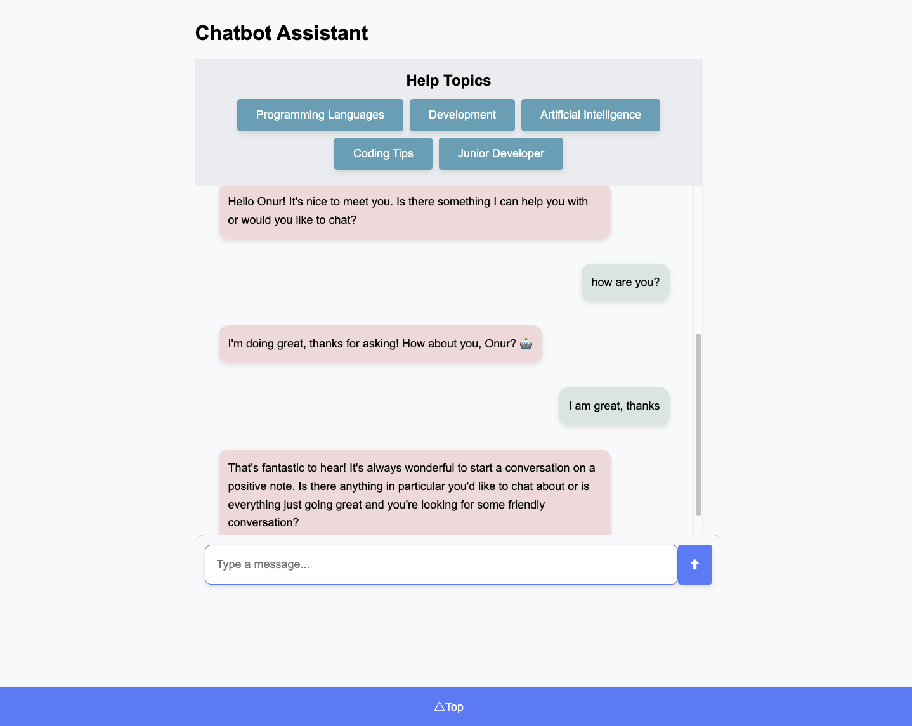

## Screenshots



## Example Usage

- **User**: Hello
- **Bot**: Hello! What's your name? 😊

- **User**: How can I improve my coding skills?
- **Bot**: Improving your coding skills requires consistent effort and the right strategies. Here are some detailed tips...

# DevChatbot-AI

DevChatbot-AI is a Flask-based AI chatbot DEVELOPER HELP application that interacts with users using natural language processing (NLP). The chatbot responds to predefined intents from `intents.json` and uses the Groq API for answers to unknown queries. The application is trained using `train.py` and can be deployed on Render.

## Project Structure

The project is organized as follows:

```
devchatbot-ai/
├── data/
│   └── intents.json          # Predefined intents and sample phrases for the chatbot
├── flask_session/            # Flask session data
├── static/
│   ├── css/
│   │   └── styles.css        # CSS styles for the frontend
│   ├── js/
│   │   └── script.js         # JavaScript for interactive features
│   └── images/
│       └── chatbot_screenshot.png
├── models/
│   ├── chatbot_model.h5      # Trained chatbot model
│   ├── label_encoder.pickle  # Label encoder for intent classification
│   └── tokenizer.pickle      # Tokenizer for text processing
├── templates/
│   └── index.html            # HTML template for the chatbot interface
├── venv/                     # Python virtual environment
├── .env                      # Environment variables (API keys, secret key)
├── .gitignore                # Files ignored by Git
├── app.py                    # Main Flask application file
├── gunicorn.conf.py          # Gunicorn configuration for production
├── Procfile                  # Procfile for deployment
├── requirements.txt          # Python dependencies
├── setup.py                  # Setup script for package installation
├── train.py                  # Script to train the chatbot model
└── user_data.py              # Helper file for user data processing
```

## Setup

1. **Prerequisites**: Ensure you have Python 3.8 or higher installed.

2. **Create a Virtual Environment**:

   ```bash
   python3 -m venv venv
   source venv/bin/activate  # Linux/MacOS
   venv\Scripts\activate     # Windows


   ```

3. **Install Dependencies**:
   nstall Dependencies:

pip install -r requirements.txt
Set Up Environment Variables:
Create a .env file and add the following:

4. **Set Up Environment Variables**:
   SECRET_KEY=your_secret_key
   GROQ_API_KEY=your_groq_api_key
   Train the Model (Optional):
   If you want to retrain the model, run:

5. **Train the Model (Optional)**:
   python train.py

### Running the Application

1. **Run the Flask App:**

python app.py
The app will be available at http://127.0.0.1:5000.

2. **Run with Gunicorn (For Production):**

gunicorn --config gunicorn.conf.py app:app

### Usage

1. Open your browser and navigate to http://127.0.0.1:5000.

2. Interact with the chatbot by typing messages. The bot will respond based on the intents in intents.json or fetch answers from the Groq API if the query is unknown.

### Deployment on Render

1. Create a Render Account: Sign up at Render.

2. Create a New Web Service:

   -Connect your GitHub repository to Render.

   -Select the repository containing this project.

3. Configure the Web Service:

   -Set the Build Command to:

   bash
   pip install -r requirements.txt

   -Set the Start Command to:
   bash
   gunicorn --config gunicorn.conf.py app:app

   -Add environment variables (SECRET_KEY and GROQ_API_KEY) in the Render dashboard.

### Deploy:

-Click "Deploy" to start the deployment process.

-Once deployed, your chatbot will be live at the provided Render URL.

### Contributing

If you'd like to contribute to this project, please fork the repository and submit a pull request.

### License

This project is licensed under the MIT License. See the LICENSE file for details.
